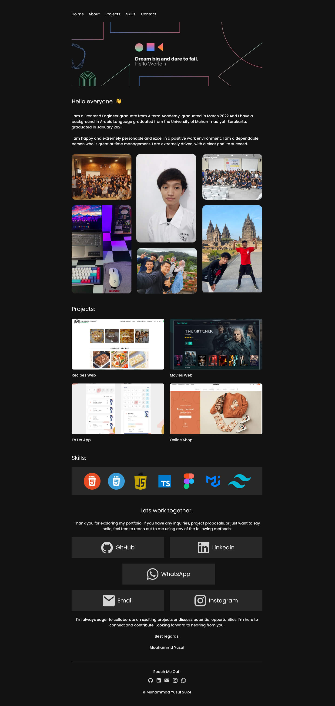

# Muhammad Yusuf's Portfolio Website / myusufuw.com

Welcome to my personal portfolio website repository! This website showcases my skills, projects, and experiences as a Fullstack Web Developer.

## Table of Contents

- [About](#about) ℹ️
- [Preview](#preview) 🖼
- [Features](#features) 🌟
- [Technologies and Tools Used](#technologies) ⚙️
- [References](#references) 📝
- [Links](#links) 📩

## About

This website serves as a platform to display my professional work, skills, and achievements. It provides visitors with an overview of who I am, what I do, and the projects I have worked on.

## Preview

## Features

- **Home:** Tagline overview.
- **About:** Introduction my profiles and brief overview.
- **Projects:** Showcase of my projects with descriptions and links.
- **Contact:** Contact form for inquiries and collaborations.

<h2 id="technologies">Technologies and Tools Used</h2>

- HTML5
- CSS3
- Javascript
- VS Code
- [AOS Js](https://michalsnik.github.io/aos/)
- [Vercel](https://vercel.com/)

## References

- [MUI](https://mui.com/)
- [Colorffy](https://colorffy.com/dark-theme-generator)
- [Lee Robinson](https://leerob.io/)
- [Theodorus Clarence](https://theodorusclarence.com/)

## Links

- [Figma 🎨](https://www.figma.com/file/6E4ZIQAwG488wM0Zm67EU8/Transporta-v4?node-id=35%3A19463&mode=dev)
- [Github 🗃️](https://github.com/myusufuw)
- [Linkedin 🙋‍♂️](https://www.linkedin.com/in/myusufuw/)
- [myusufuw.com ✨](https://myusufuw.com)
